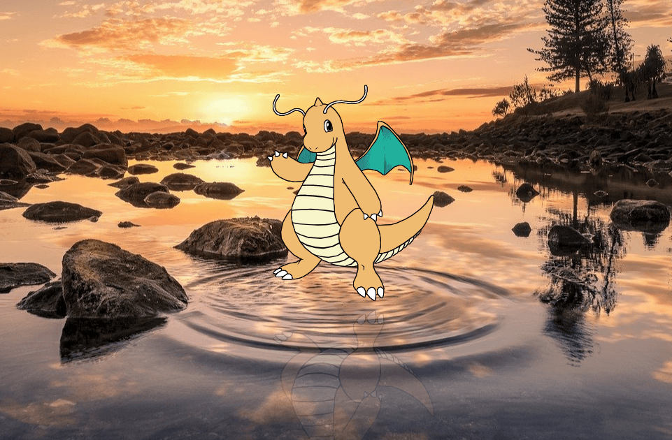
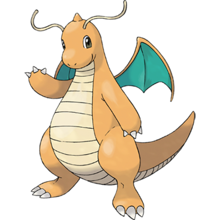

# Pokecss - Dragonite

Dragonite made for the #Pokecss challenge that takes place on twitter!

**Preview:** [https://hectormr206.github.io/pokecss-dragonite/](https://hectormr206.github.io/pokecss-dragonite/)



## 🚀 Tutorial

Like you, I was always curious to understand the possibilities that can be achieved with pure CSS. So one day they invited me to be part of the #Pokecss challenge, in which we have to make a first generation Pokémon with html and css.

I immediately thought of Dragonite, a cute but powerful Pokemon. So I set out to research what they need to create it.

In this tutorial I will show you the most relevant steps to get started in drawing with css.

The first thing we need is to get the image of our Dragonite; at a good resolution to view it in detail. Which we will place with transparency in a **img** label.

```

```

We add some styles to anchor the size of the design that we are going to need.

```
.img {
  width: 620px;
  min-width: 620px;
  height: 620px;
  opacity: 0.2;
}
```

> I used 620px to get the image to the largest size that would allow me to see all the details.

> And with the help of the zoom in the browser, we can focus on much more detail.

### Now, let's get to work!

The magic of drawing with css is based on the **clip-path** property, with which we can make clips to show only a part of our element. And we can move each one with the **position** property.

#### Eyes first

The first thing I did were the eyes, so from the browser I increased the zoom to 500%; I focused on the right eye with the help of the navigation bars.

```
.head__eye-edge-right {
  position: absolute;
  top: 91px;
  left: 143px;
  width: 28px;
  height: 45px;
  background-color: #010100;
  transform: rotate(-11deg);
  clip-path: ellipse(44% 50% at 50% 70%);
}
```

> position: absolute; We position our container **head__eye-edge-right** out of the way.

> top: 91px; We move the container up and down to the position where our right eye is.

> left: 143px; We move from left to right to position ourselves.

> width: 28px; We adjust the width of our container with respect to that of our right eye.

> height: 45px; We adjust the height of our container.

> background-color: # 010100; We add the color.

> transform: rotate (-11deg); we rotate our container.

> clip-path: ellipse (44% 50% at 50% 70%);

>> ellipse: Clip our container into an ellipse.

>> 44%: Size of the width of our ellipse.

>> 50%: Size of the height of our ellipse.

>> at: in.

>> 50%: Position of the ellipse with respect to the width.

>> 70%: Position of the ellipse with respect to the height.


#### Let's continue with the antennas

Here use a container between another container. Why? Well then to add a shadow that surrounds my entire antenna.

```
<div class = "head__antenna-edge-left">
   <div class = "head__antenna-left"> </div>
</div>
```

Using the following styles:

```
.head__antenna-edge-left, {
  position: absolute;
  filter: drop-shadow(2px 0px 0px var(--border-color)) drop-shadow(-2px 0px 0px var(--border-color)) drop-shadow(0px 2px 0px var(--border-color)) drop-shadow(0px -2px 0px var(--border-color));
}
```

> filter: drop-shadow (2px 0px 0px # 010100) drop-shadow (-2px 0px 0px # 010100) drop-shadow (0px 2px 0px # 010100) drop-shadow (0px -2px 0px # 010100); We create a shadow filter for our container.

>> drop-shadow: Filter that helps us to mount a shadow according to the shape of the object.

>> 2px: Move the shadow to the left or right.

>> 0px: Move the shadow up or down.

>> 0px: Shadow blur.

>> #010100: Shadow color.

```
.head__antenna-left {
    position: absolute;
    width: 100px;
    height: 100px;
    background-color: #fff;
    clip-path: polygon( 17% 29%, 14% 30%, 11% 35%, 4% 50%, 2% 59%, 3% 69%, 5% 74%, 8% 78%, 12% 82%, 17% 85%, 26% 87%, 32% 86%, 42% 83%, 49% 80%, 56% 76%, 62% 73%, 67% 72%, 74% 73%, 80% 75%, 86% 80%, 90% 87%, 92% 84%, 89% 80%, 86% 76%, 81% 72%, 76% 70%, 69% 69%, 62% 70%, 56% 73%, 49% 77%, 43% 80%, 34% 83%, 27% 84%, 22% 83%, 19% 82%, 15% 80%, 10% 76%, 7% 71%, 5% 64%, 5% 57%, 7% 49%, 10% 43%, 14% 37%, 16% 34%, 18% 31% );
}
```

> polygon: Finite sequence of lines that helps us to form any figure.

> 17% 29%: Position in percentages at position x / y respectively. With comma separations, to form each point where our container will be cut.


#### We finish with the reflection

To make the reflection, we make use of the property **- webkit-box-reflect**; Currently only supported by the Chromium project.

```
.container {
  -webkit-box-reflect: below -140px -webkit-gradient(linear, left top, left bottom, from(transparent), to(rgba(255, 255, 255, 0.2)));
}
```
> -webkit-box-reflect: below -140px -webkit-gradient (linear, left top, left bottom, from (transparent), to (rgba (255, 255, 255, 0.2))); Create the reflection effect.

>> below: Place the reflection under the container.

>> -140px: Length of the reflection.

>> -webkit-gradient (linear, left top, left bottom, from (transparent), to (rgba (255, 255, 255, 0.2))): Mask that will be applied to the reflection. In this case a gradient that begins transparent and ends in a transparency of 20%.


With this, you have the necessary tools to start drawing with CSS.

From here, your imagination has no limits!

## 🧾 License

The MIT License (MIT)

## 💻 Technologies

- HTML
- CSS

## 📖 Reference
* [https://www.youtube.com/watch?v=IP3OmWpUuIg](https://www.youtube.com/watch?v=IP3OmWpUuIg)
* [https://medium.com/@carlacentenor/dibujando-con-css-y-html-nivel-beginner-b6ed7103e627](https://medium.com/@carlacentenor/dibujando-con-css-y-html-nivel-beginner-b6ed7103e627)
* [https://github.com/mariwrios/pokecss-mew](https://github.com/mariwrios/pokecss-mew)
* [https://developer.mozilla.org/en-US/docs/Web/CSS/filter-function/drop-shadow](https://developer.mozilla.org/en-US/docs/Web/CSS/filter-function/drop-shadow)
* [https://bennettfeely.com/clippy/](https://bennettfeely.com/clippy/)
* [https://codepen.io/jorgemaiden](https://codepen.io/jorgemaiden/pen/ZYRRYy?__cf_chl_jschl_tk__=0af9513012ba133ca735a7f8b396b00735e161d1-1604047040-0-AcLHm5a5Vl10Bk3OqtyNXmwZgpvxl81cYvQK3iYkBVcLCRboqSonJvZbofm_nYWSWS0qTfoFTZq5k0FhIxVwiifxz6ZtDGO9gRKuWgN8jt9HFQRa9VePpz6IrjYoO6fjuda3PibmueYXlVm7HTkqsShpMlCq7jpcQybECC79tkj9BsHlpAjJ_EKK1sYxiZBdglELQEiwvI4wX_jKtcfLOJ14Py2AzD2_NgMzt-CPH9pwmcCdY4q3ghyRdJZDWXsEtYOFWI1x00ilAJEWTKv8Tqew1XeKXAydDzBbU49zbS09-yipzqEAjYNI1C9wM3780eYpCLFZfozw2EbVrlABI_vSDhQCulNBurTvcdAv-r4z)